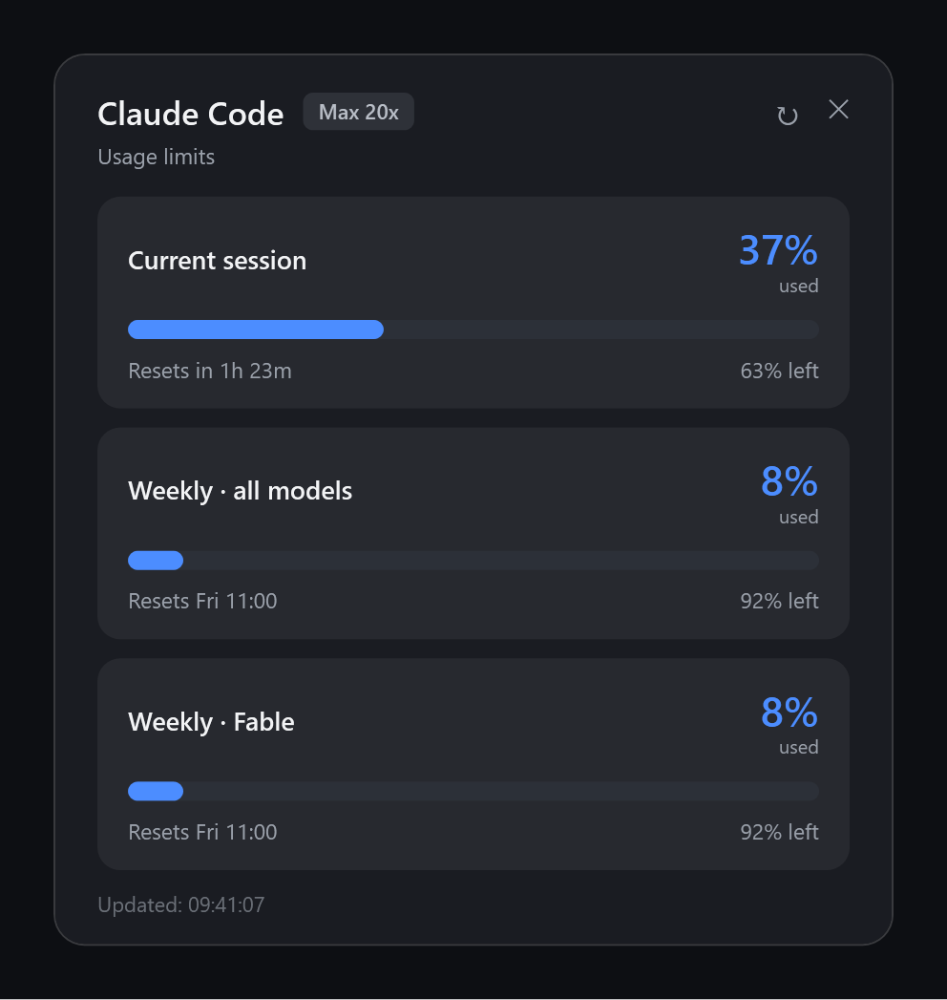
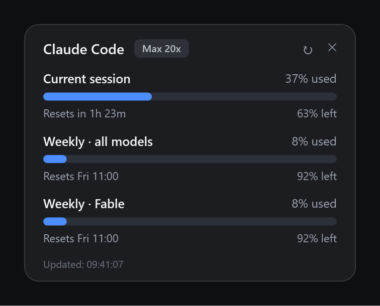

# Claude Usage Widget

> 🇹🇷 [Türkçe README](README.tr.md)

Lightweight Windows indicators for your **Claude Code** session and weekly usage limits. Pure PowerShell + WPF — **zero dependencies, nothing to install**.

A small pill docked at the left edge of your taskbar shows a live summary. Click it and a panel flies out with every limit: used %, remaining %, and reset times — the exact same data as *claude.ai → Settings → Usage*.



| Taskbar pill (always visible) | Floating card (optional) |
| --- | --- |
|  |  |

## Features

- **Taskbar pill** — `✳ Session 37% · Week 8%` sits in the empty left corner of your taskbar
- **Flyout panel** — click the pill: all limits with bars, big percentages, reset countdowns; closes on outside click / Esc
- **Floating card** — an optional draggable desktop widget showing the same data
- **Color coding** — blue → orange at 70% → red at 90% (also driven by the API's severity field)
- Auto-refresh every 60 s with rate-limit-aware backoff (respects HTTP 429)
- **English / Turkish** UI, auto-detected from your Windows display language
- Survives token expiry gracefully — just run any `claude` command and it recovers

## Requirements

- Windows 10/11 (PowerShell 5.1 is built in — nothing else needed)
- [Claude Code](https://claude.com/claude-code) logged in with a **subscription plan** (Pro / Max). Usage limits are a subscription concept; API-key billing has no session/weekly limits.

## Install

One-liner (PowerShell):

```powershell
irm https://raw.githubusercontent.com/demirkolorg/claude-usage-widget/main/install.ps1 | iex
```

This downloads the files to `%LOCALAPPDATA%\ClaudeUsageWidget`, adds the pill to Windows startup, and starts it immediately.

Or from a clone:

```powershell
git clone https://github.com/demirkolorg/claude-usage-widget.git
cd claude-usage-widget
.\install.ps1
```

### Install options

```powershell
.\install.ps1                 # taskbar pill (default)
.\install.ps1 -Mode widget    # floating card instead
.\install.ps1 -Mode both      # both
.\install.ps1 -NoStartup      # don't add to Windows startup
.\install.ps1 -NoStart        # don't start now
.\install.ps1 -Uninstall      # remove everything
```

Remote install with options:

```powershell
& ([scriptblock]::Create((irm https://raw.githubusercontent.com/demirkolorg/claude-usage-widget/main/install.ps1))) -Mode both
```

## Usage

| Action | How |
| --- | --- |
| Open / close the panel | Left-click the pill (outside click or Esc also closes) |
| Quick summary | Hover the pill — all limits in a tooltip |
| Refresh now | ↻ in the panel, or right-click → Refresh (auto every 60 s) |
| Quit | Right-click the pill → Quit |
| Move the floating card | Drag it (position is remembered) |

## Configuration

Create an optional `config.json` next to the scripts:

```json
{
  "language": "auto",
  "refreshSeconds": 60
}
```

- `language` — `auto` (default, follows Windows), `en`, or `tr`
- `refreshSeconds` — polling interval

## How it works & privacy

The scripts read Claude Code's own OAuth token from `~/.claude/.credentials.json` and call Anthropic's official usage endpoint (`api.anthropic.com/api/oauth/usage`) — nothing else. The token is sent **only** to Anthropic as a Bearer header, is never written anywhere, and no third-party service is involved. The token is never refreshed or modified; if it expires, run any `claude` command and the indicator recovers on the next tick.

## Troubleshooting

- **"Token invalid (401)"** — run any `claude` command once; Claude Code refreshes the token itself.
- **"Credentials file not found"** — log in first: `claude login` (or `claude` and follow the prompts).
- **Rate limited (429)** — the app backs off for 5 minutes automatically; manual ↻ still forces a try.
- **Pill hidden behind the taskbar** — it re-asserts itself every 3 s; if it ever sticks, right-click → Quit and start it again.
- **Self test** — verify the data pipeline without any UI:
  `powershell -STA -File ClaudeUsageTaskbar.ps1 -SelfTest`

## Uninstall

```powershell
.\install.ps1 -Uninstall
```

or remotely:

```powershell
& ([scriptblock]::Create((irm https://raw.githubusercontent.com/demirkolorg/claude-usage-widget/main/install.ps1))) -Uninstall
```

## Repository layout

| File | Purpose |
| --- | --- |
| `ClaudeUsageTaskbar.ps1` | Taskbar pill + flyout panel |
| `ClaudeUsageWidget.ps1` | Floating card widget |
| `UsageCore.ps1` | Shared data layer, localization, UI helpers |
| `StartTaskbar.vbs` / `StartWidget.vbs` | Console-less launchers |
| `install.ps1` | Installer / uninstaller |
| `tools/make-screenshots.ps1` | Regenerates the README screenshots offscreen |

## License

[MIT](LICENSE)
