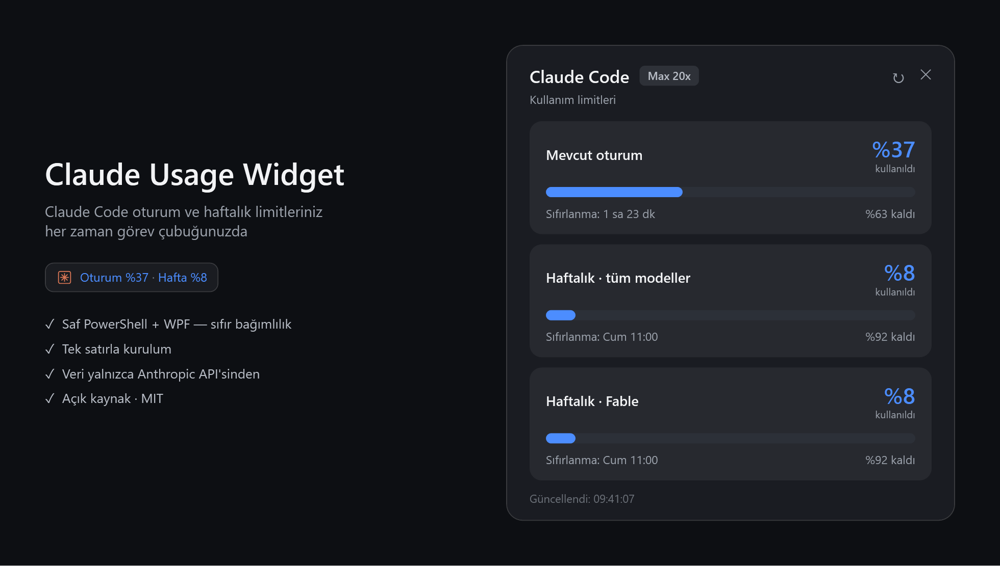
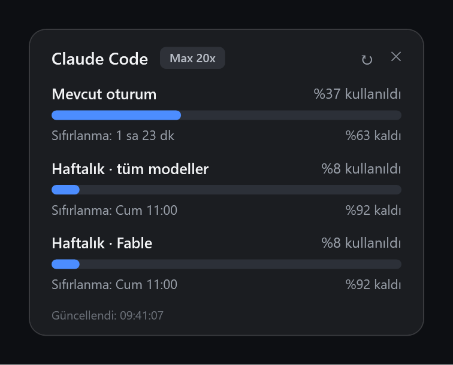

# Claude Usage Widget

> 🇬🇧 [English README](README.md)

**Claude Code** oturum (5 saatlik) ve haftalık kullanım limitlerini gösteren hafif Windows göstergeleri. Saf PowerShell + WPF — **sıfır bağımlılık, kurulum derdi yok**.

Görev çubuğunuzun sol köşesine yaslanan küçük bir rozet canlı özet gösterir. Tıkladığınızda tüm limitleri içeren bir panel açılır: kullanılan %, kalan % ve sıfırlanma zamanları — *claude.ai → Settings → Usage* sayfasındaki verinin birebir aynısı.



| Taskbar rozeti (hep görünür) | Kart widget (isteğe bağlı) |
| --- | --- |
|  |  |

## Özellikler

- **Taskbar rozeti** — `✳ Oturum %37 · Hafta %8` görev çubuğunun boş sol köşesinde durur
- **Açılır panel** — rozete tıklayın: barlar, büyük yüzdeler ve sıfırlanma sayaçlarıyla tüm limitler; dışarı tıklayınca veya Esc ile kapanır
- **Kart widget** — aynı veriyi gösteren, sürüklenebilir isteğe bağlı masaüstü kartı
- **Renk kodlaması** — mavi → %70'te turuncu → %90'da kırmızı (API'nin severity alanı da dikkate alınır)
- 60 saniyede bir otomatik yenileme, hız sınırına duyarlı geri çekilme (HTTP 429)
- **Türkçe / İngilizce** arayüz, Windows görüntüleme dilinden otomatik algılanır
- Token süresi dolarsa sorun çıkarmaz — herhangi bir `claude` komutu çalıştırın, kendine gelir

## Gereksinimler

- Windows 10/11 (PowerShell 5.1 yerleşiktir — başka bir şey gerekmez)
- **Abonelik planıyla** (Pro / Max) giriş yapılmış [Claude Code](https://claude.com/claude-code). Kullanım limitleri abonelik kavramıdır; API anahtarıyla faturalandırmada oturum/haftalık limit yoktur.

## Kurulum

Tek satır (PowerShell):

```powershell
irm https://raw.githubusercontent.com/demirkolorg/claude-usage-widget/main/install.ps1 | iex
```

Dosyaları `%LOCALAPPDATA%\ClaudeUsageWidget` içine indirir, rozeti Windows başlangıcına ekler ve hemen başlatır.

Veya klonlayarak:

```powershell
git clone https://github.com/demirkolorg/claude-usage-widget.git
cd claude-usage-widget
.\install.ps1
```

### Kurulum seçenekleri

```powershell
.\install.ps1                 # taskbar rozeti (varsayılan)
.\install.ps1 -Mode widget    # onun yerine kart widget
.\install.ps1 -Mode both      # ikisi birden
.\install.ps1 -NoStartup      # Windows başlangıcına ekleme
.\install.ps1 -NoStart        # şimdi başlatma
.\install.ps1 -Uninstall      # her şeyi kaldır
```

Uzaktan kurulumda seçenek kullanmak için:

```powershell
& ([scriptblock]::Create((irm https://raw.githubusercontent.com/demirkolorg/claude-usage-widget/main/install.ps1))) -Mode both
```

## Kullanım

| Eylem | Nasıl |
| --- | --- |
| Paneli aç / kapat | Rozete sol tıkla (dışarı tıklama veya Esc de kapatır) |
| Hızlı özet | Rozetin üzerine gel — tüm limitler tooltip'te |
| Şimdi yenile | Paneldeki ↻ veya sağ tık → Yenile (otomatik: 60 sn) |
| Kapat | Rozete sağ tık → Kapat |
| Kart widget'ı taşı | Sürükle (konum hatırlanır) |

## Yapılandırma

Scriptlerin yanına isteğe bağlı bir `config.json` oluşturun:

```json
{
  "language": "auto",
  "refreshSeconds": 60
}
```

- `language` — `auto` (varsayılan, Windows dilini izler), `en` veya `tr`
- `refreshSeconds` — sorgulama aralığı

## Nasıl çalışır ve gizlilik

Scriptler, Claude Code'un kendi OAuth token'ını `~/.claude/.credentials.json` dosyasından okur ve yalnızca Anthropic'in resmî kullanım endpoint'ini (`api.anthropic.com/api/oauth/usage`) çağırır. Token **sadece** Anthropic'e Bearer başlığı olarak gönderilir, hiçbir yere yazılmaz ve üçüncü taraf servis kullanılmaz. Token asla yenilenmez veya değiştirilmez; süresi dolarsa herhangi bir `claude` komutu çalıştırın, gösterge sonraki yenilemede düzelir.

## Sorun giderme

- **"Token geçersiz (401)"** — Herhangi bir `claude` komutu çalıştırın; token'ı Claude Code kendisi yeniler.
- **"Kimlik dosyası bulunamadı"** — Önce giriş yapın: `claude login` (veya `claude` yazıp yönergeleri izleyin).
- **Hız sınırı (429)** — Uygulama 5 dakika kendiliğinden geri çekilir; elle ↻ yine de dener.
- **Rozet görev çubuğunun arkasında kaldı** — 3 saniyede bir kendini öne çeker; takılı kalırsa sağ tık → Kapat deyip yeniden başlatın.
- **Kendi kendine test** — UI açmadan veri hattını doğrulayın:
  `powershell -STA -File ClaudeUsageTaskbar.ps1 -SelfTest`

## Kaldırma

```powershell
.\install.ps1 -Uninstall
```

veya uzaktan:

```powershell
& ([scriptblock]::Create((irm https://raw.githubusercontent.com/demirkolorg/claude-usage-widget/main/install.ps1))) -Uninstall
```

## Depo düzeni

| Dosya | Görev |
| --- | --- |
| `ClaudeUsageTaskbar.ps1` | Taskbar rozeti + açılır panel |
| `ClaudeUsageWidget.ps1` | Kart widget |
| `UsageCore.ps1` | Ortak veri katmanı, yerelleştirme, UI yardımcıları |
| `StartTaskbar.vbs` / `StartWidget.vbs` | Konsolsuz başlatıcılar |
| `install.ps1` | Kurucu / kaldırıcı |
| `tools/make-screenshots.ps1` | README ekran görüntülerini yeniden üretir |

## Lisans

[MIT](LICENSE)
